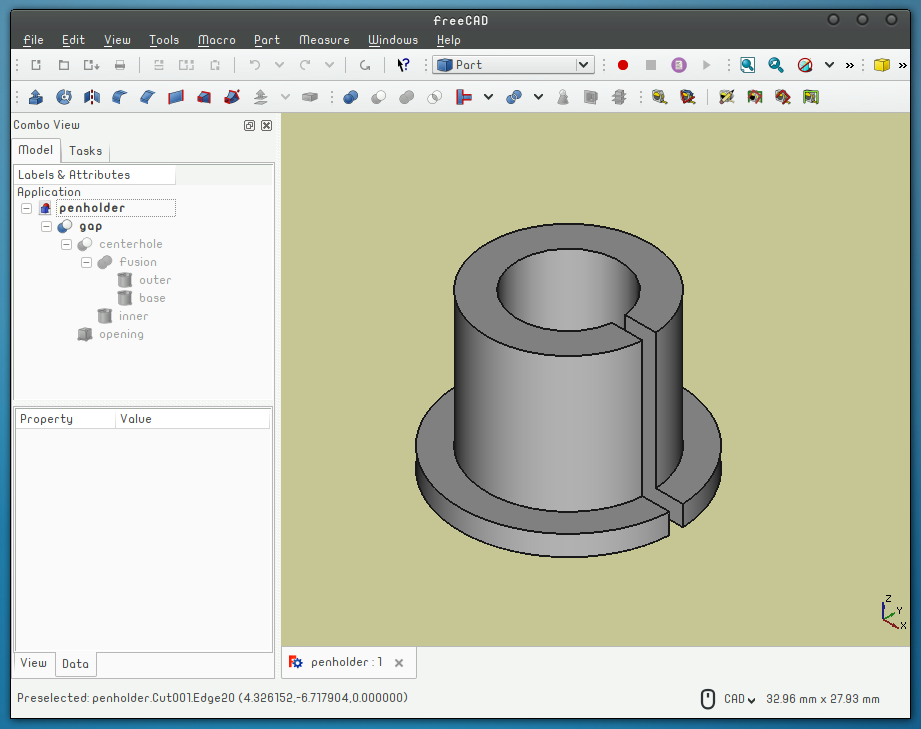

# Roland VinylDraw

This is a parametric FreeCAD adapter for drawing using the Roland GS-24 Vinyl Cutter. 3D print with solid infill with no adhesion platform.

Make sure that the gap is not perpendicular to the grip mechanism, otherwise it will not work. Make sure that the pen up/pen down mechanism has some freedom of movement (2-3 mm) before usage. For a [bic crystal](https://en.wikipedia.org/wiki/Bic_Cristal) pen I use 150 g of force and 30 cm/s.

Licensed under MIT License, enjoy!

Francisco

